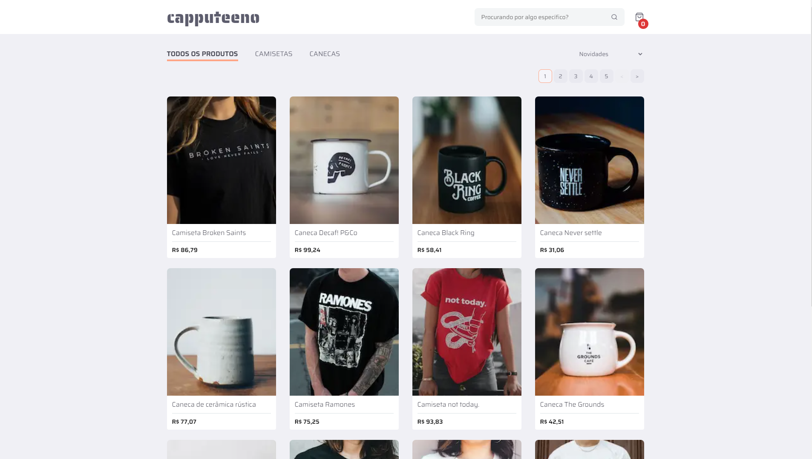

<h1 align="center">🚀 Front-end challenge 🚀</p>




# 📖 Projeto

Este projeto é resultado de um desafio elaborado pela Rocketseat, [Front-end Challenge](https://github.com/Rocketseat/frontend-challenge). O desafio consiste em implementar um e-commerce para venda de canecas e camisetas que tenha as seguintes funcionalidades:

- [x] Catálogo de produtos com paginação
- [x] Filtragem produtos por categoria
- [x] Busca por nome do produto
- [x] Adicionar e remover produtos do carrinho
- [x] Finalizar compra


## 🚀 Como executar

Para inicializar o projeto localmente siga os passos descritos abaixo:

```bash
# Clone o repositório
$ git clone https://github.com/d0ugui/capputeeno.git

# Entre no repositório
$ cd capputeeno

# Instale as dependências
$ yarn install

# Execute a aplicação
$ yarn start

# Acesse a pasta api
$ cd capputeeno/api

# Inicie a API GraphQL
$ yarn start

# Acessar a aplicação
$ http://localhost:3000

# Playground da API GraphQL
$ http://localhost:3333
```

## 🧪 Tecnologias

 [](https://skillicons.dev)
